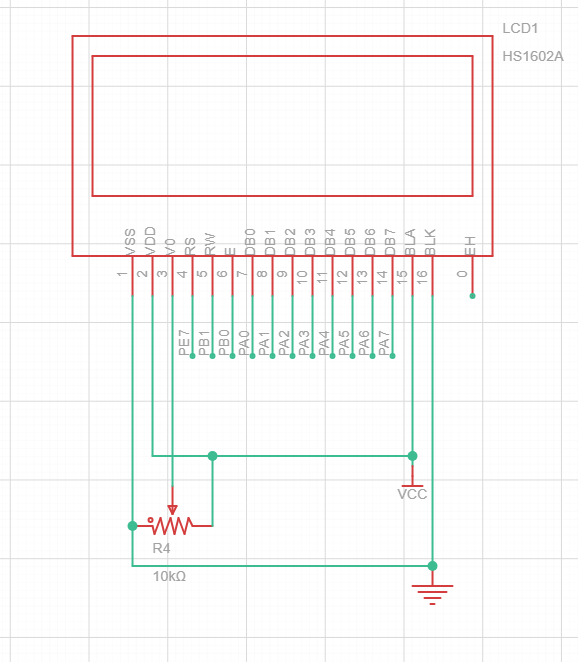

# LCD1602A-Character-LCD-Driver-Based-on-STM32-HAL-Library

This is a driver program for the LCD1602A character display, written for STM32 microcontrollers using the STM32 HAL library.

The `Driver_Function` folder contains the LCD1602A driver and the associated `main.c` file.

This driver is very straightforward — you only need to call three functions to print a string anywhere on the screen. The three functions are: 
- `LCD_Init` — initializes the display; 
- `LCD_Clear` — clears all pixels on the screen; 
- `LCD_WriteString` — prints a string at the specified position.

Below is the schematic diagram for the test setup. Wire the components as shown, flash the test program onto the chip, and the screen will display strings accordingly.

Note: If you want to use different GPIO pins to control the display, simply change the pin macros in `LCD.h` and initialize the corresponding pins in STM32CubeMX.

